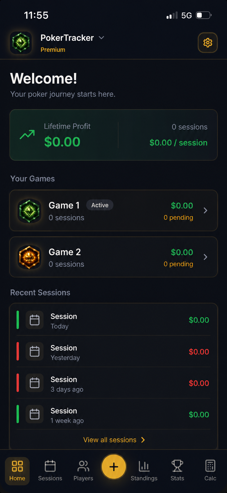

# Stack Tracker

A progressive web app for tracking home poker games — buy-ins, cash-outs,
settlements, leaderboards and long-run player statistics.

**Live:** [stack-tracker.com](https://www.stack-tracker.com)



---

## What it does

A home game generates a surprising amount of bookkeeping: who rebought, who
left early, who owes whom, and who is actually up over the year. Stack Tracker
replaces the group chat and the spreadsheet.

- **Sessions** — log buy-ins and cash-outs per player, with mid-session rebuys.
- **Settlements** — reduces everyone's net position to the fewest transfers
  needed to square up.
- **Leaderboard** — profit, hourly rate, variance and streaks across all
  sessions in a homegame.
- **Personal stats** — per-player history, best and worst sessions, and
  achievement badges.
- **Homegames** — multiple independent groups, each with its own members,
  invite codes and roles.
- **Push notifications** — Web Push alerts when a session is created or
  settled.
- **Installable** — runs as a PWA on iOS and Android home screens.

Two tools are public and need no account: a
[settlement calculator](https://www.stack-tracker.com/poker-settlement-calculator)
and a [hand calculator](https://www.stack-tracker.com/poker-hand-calculator).

## Stack

React 18 · TypeScript · Vite · Tailwind CSS · shadcn/ui · Supabase (Postgres,
Auth, Realtime, Edge Functions) · deployed on Vercel.

## Worth a look

A few parts that were more interesting than standard CRUD:

**Settlement minimisation** (`src/lib/publicSettlement.ts`) — repeatedly
matches the largest debtor against the largest creditor, so a nine-player
session settles in a handful of payments instead of everyone paying everyone.
Sub-cent residuals are tolerated so floating-point dust doesn't produce
one-cent transfers.

**Hand evaluator** (`src/lib/poker/`) — a from-scratch 5-to-7 card evaluator
with side-pot resolution for all-in multiway spots. No poker library
dependency.

**Row Level Security** (`supabase/migrations/`) — access control lives in the
database, not the client. 23 migrations define the schema and roughly 60
policies; a `shares_homegame_with()` security-definer helper scopes profile
visibility to people you actually play with, and homegame membership inserts
are constrained so a known UUID can't be used to grant yourself ownership.

**Prerendered public pages** (`scripts/prerender.mjs`) — the about and
calculator routes are server-rendered at build time and emitted as static HTML
so they are indexable, while the authenticated app stays a client-side SPA.

**Security headers** (`vercel.json`) — CSP, HSTS, and frame-ancestors denial
are set at the edge.

## Running locally

```bash
npm install
cp .env.example .env      # fill in your Supabase project URL and anon key
npm run dev
```

The Supabase schema is fully reproducible from this repo:

```bash
supabase db reset         # applies all migrations to a local Postgres
```

Edge functions live in `supabase/functions/` and expect `VAPID_PRIVATE_KEY`,
`SUPABASE_SERVICE_ROLE_KEY` and `ALLOWED_ORIGIN` in the function environment.

## Layout

```
src/
  pages/          route components
  components/     app components; components/ui is shadcn
  hooks/          data access — one hook per domain area
  lib/            pure logic: settlement, leaderboard, badges, poker evaluator
  integrations/   generated Supabase types and client
supabase/
  migrations/     schema + RLS policies
  functions/      Deno edge functions
scripts/          build-time prerender
```

## Status

Live and in regular use by a real home game. Actively developed — React Query
is installed but not yet adopted, and test coverage is minimal.

## License

Copyright © 2026 Matan Kimchi. All rights reserved. Published for portfolio and
evaluation purposes only — see [LICENSE](LICENSE). Please don't reuse or
redistribute the code without permission.
